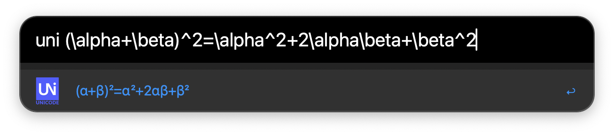
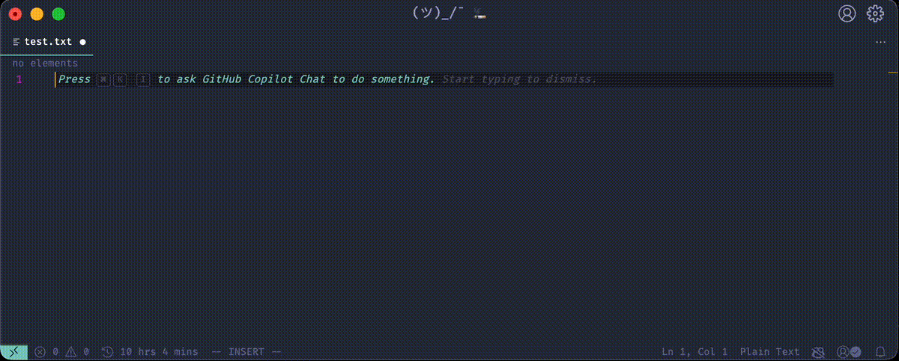

# Unicodeit with Alfred

	

<b><i>
	Type Unicode with LaTeX!
</i></b>

## Abstract

Inspired by [unicodeit](https://github.com/svenkreiss/unicodeit), but in Alfred! Starting with `uni`, then you can type $\LaTeX$ code and change it to Unicode easily. To download the workflow, see the [release page](https://github.com/sleepymalc/unicodeit/releases).

## Setup
Zip the contents of src/ as `unicodeit.alfredworkflow` and import it into Alfred.

## Demo

